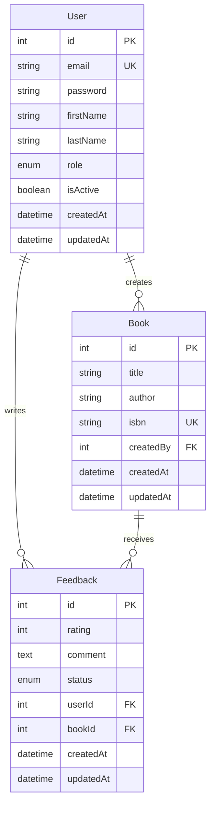

# 📚 Book Management Portal - Backend API

A comprehensive NestJS-based backend API for managing books, user authentication, and feedback systems with role-based access control, rate limiting, and comprehensive testing.

[](https://nestjs.com/)
[](https://www.typescriptlang.org/)
[](https://www.postgresql.org/)
[](https://jwt.io/)
[](https://swagger.io/)

## 🚀 Features

### 🔐 Authentication & Authorization
- **JWT-based authentication** with secure token handling
- **Role-based access control** (Admin, User roles)
- **Account suspension** with proper error handling
- **Password hashing** using bcryptjs
- **Profile management** for users
- **Admin user management** (create, update, delete users)

### 📖 Book Management
- **CRUD operations** for books (Create, Read, Update, Delete)
- **ISBN validation** with flexible length support (10-17 characters)
- **Book ownership** tracking (who created the book)
- **Advanced filtering** by title, author, or ISBN
- **Pagination** for large datasets
- **User-specific book lists** (my books vs all books)
- **Admin book management** (can manage any book)

### 💬 Feedback System
- **Rating system** (1-5 stars) with validation
- **Comment system** with text validation
- **Rate limiting** (1 feedback per minute per user)
- **Feedback moderation** (Admin can hide/show feedback)
- **Feedback updates** (Users can edit their own feedback)
- **Book-specific feedback** viewing
- **User-specific feedback** tracking

### 🛡️ Security & Performance
- **Global rate limiting** with custom throttling strategies
- **CORS configuration** for frontend integration
- **Input validation** using class-validator
- **SQL injection protection** via TypeORM
- **Environment-based configuration**
- **Comprehensive error handling**

### 📊 API Documentation
- **Swagger/OpenAPI** integration
- **Interactive API documentation**
- **Request/Response examples**
- **Authentication testing** in Swagger UI
- **Comprehensive endpoint documentation**

### 🧪 Testing
- **Unit tests** for services and controllers
- **Integration tests** for API endpoints
- **Test coverage** reporting
- **Database cleanup** for test isolation
- **Mock implementations** for external dependencies

### 🌱 Database Seeding
- **Comprehensive test data** with 19 users, 40+ books, 50+ feedback
- **Realistic relationships** between users, books, and feedback
- **Diverse data sets** across multiple genres and user types
- **Automated seeding scripts** for development and testing
- **Data integrity** with proper foreign key relationships

## 🏗️ Architecture Overview

### Project Structure
```
src/
├── auth/                    # Authentication module
│   ├── decorators/         # Custom decorators (roles)
│   ├── dto/               # Data Transfer Objects
│   ├── entities/          # User entity
│   ├── guards/            # JWT and role guards
│   ├── strategies/        # Passport strategies
│   └── *.spec.ts          # Unit tests
├── books/                  # Book management module
│   ├── dto/               # Book DTOs
│   ├── entities/          # Book entity
│   └── *.spec.ts          # Unit tests
├── feedback/               # Feedback module
│   ├── dto/               # Feedback DTOs
│   ├── entities/          # Feedback entity
│   ├── feedback-throttler.guard.ts
│   └── *.spec.ts          # Unit tests
├── common/                 # Shared utilities
│   └── guards/            # Custom throttler guard
├── app.module.ts          # Root module
└── main.ts               # Application entry point
```

### Database Schema


### Technology Stack

| Component | Technology | Version | Purpose |
|-----------|------------|---------|---------|
| **Framework** | NestJS | 10.0.0 | Backend framework |
| **Language** | TypeScript | 5.1.3 | Type-safe JavaScript |
| **Database** | PostgreSQL | 8.16.3 | Primary database |
| **ORM** | TypeORM | 0.3.27 | Database abstraction |
| **Authentication** | JWT + Passport | 11.0.0 | Token-based auth |
| **Validation** | class-validator | 0.14.2 | Input validation |
| **Documentation** | Swagger | 8.1.1 | API documentation |
| **Rate Limiting** | @nestjs/throttler | 6.4.0 | Request throttling |
| **Testing** | Jest | 29.5.0 | Testing framework |
| **Password Hashing** | bcryptjs | 3.0.2 | Secure password storage |

## 🎯 Technology Choices & Rationale

### **Why NestJS?**
- **Enterprise-Ready**: Built for scalable, maintainable applications
- **TypeScript First**: Full type safety and better developer experience
- **Modular Architecture**: Clean separation of concerns with modules
- **Decorator Pattern**: Declarative programming with clean, readable code
- **Built-in Features**: Authentication, validation, testing, documentation out of the box
- **Ecosystem**: Rich ecosystem with excellent community support

### **Why TypeORM over Prisma/Sequelize?**
- **Active Record Pattern**: Entities as classes with methods
- **TypeScript Integration**: Excellent TypeScript support with decorators
- **Migration Support**: Built-in database migrations
- **Query Builder**: Flexible query building with type safety
- **NestJS Integration**: Native integration with NestJS ecosystem
- **Mature & Stable**: Battle-tested in production environments

### **Why PostgreSQL over MySQL/MongoDB?**
- **ACID Compliance**: Full transactional support for data integrity
- **JSON Support**: Native JSON columns for flexible data storage
- **Advanced Features**: Window functions, full-text search, arrays
- **Performance**: Excellent performance for complex queries
- **Scalability**: Horizontal and vertical scaling capabilities
- **Open Source**: No licensing costs with enterprise features

### **Why JWT over Session-based Auth?**
- **Stateless**: No server-side session storage required
- **Scalable**: Easy horizontal scaling across multiple servers
- **Cross-Domain**: Works across different domains and services
- **Self-Contained**: All user information in the token
- **Mobile Friendly**: Works well with mobile applications
- **Industry Standard**: Widely adopted and understood

### **Why bcryptjs over Argon2/Scrypt?**
- **NPM Compatibility**: Better compatibility with Node.js ecosystem
- **Mature Library**: Well-tested and stable
- **Salt Rounds**: Configurable complexity (12 rounds = good security)
- **Wide Adoption**: Industry standard for password hashing
- **Performance**: Good balance between security and performance

### **Why class-validator over Joi/Yup?**
- **Decorator Pattern**: Clean, declarative validation
- **TypeScript Integration**: Excellent type safety and IntelliSense
- **NestJS Integration**: Native integration with validation pipes
- **Transform Support**: Built-in data transformation
- **Custom Validators**: Easy to create custom validation rules
- **Performance**: Compiled validation for better performance

### **Why Swagger over GraphQL/Postman?**
- **REST API Focus**: Perfect for RESTful API documentation
- **Interactive UI**: Built-in API testing interface
- **Code Generation**: Client SDK generation capabilities
- **NestJS Integration**: Seamless integration with decorators
- **Industry Standard**: Widely adopted for API documentation
- **Maintenance**: Self-updating documentation

### **Why Jest over Mocha/Vitest?**
- **Zero Configuration**: Works out of the box
- **Built-in Mocking**: Excellent mocking capabilities
- **Snapshot Testing**: Visual regression testing
- **Coverage Reports**: Built-in code coverage
- **TypeScript Support**: Excellent TypeScript integration
- **NestJS Compatibility**: Recommended testing framework

### **Why Custom Throttler over Redis-based?**
- **Simplicity**: No external dependencies required
- **Memory Efficient**: In-memory tracking for development
- **User-Based**: Per-user rate limiting implementation
- **Flexibility**: Easy to customize for different endpoints
- **Development Friendly**: No additional infrastructure needed
- **Scalability**: Can be easily replaced with Redis for production

## 🎯 Technical Decisions & Design Patterns

### 🏛️ **Architecture Patterns**

#### **Modular Architecture (Domain-Driven Design)**
- **Why**: Separates concerns by business domain (Auth, Books, Feedback)
- **Implementation**: Each module contains entities, DTOs, services, controllers, and tests
- **Benefits**: 
  - Easier maintenance and testing
  - Clear separation of responsibilities
  - Scalable codebase structure
  - Independent module development

#### **Repository Pattern**
- **Why**: Abstracts data access logic from business logic
- **Implementation**: TypeORM repositories with custom query methods
- **Benefits**:
  - Database-agnostic business logic
  - Easier unit testing with mock repositories
  - Centralized data access patterns

#### **DTO Pattern (Data Transfer Objects)**
- **Why**: Validates and transforms data between layers
- **Implementation**: Class-validator decorators with transformation
- **Benefits**:
  - Input validation at API boundaries
  - Type safety across layers
  - Clear API contracts
  - Automatic serialization control

### 🔐 **Security Patterns**

#### **JWT Authentication Strategy**
- **Why**: Stateless, scalable authentication
- **Implementation**: Passport.js with JWT strategy
- **Benefits**:
  - No server-side session storage
  - Cross-service authentication
  - Self-contained token information
  - Easy token validation

#### **Role-Based Access Control (RBAC)**
- **Why**: Granular permission management
- **Implementation**: Custom decorators + guards
- **Benefits**:
  - Flexible permission system
  - Easy role management
  - Declarative security annotations
  - Reusable authorization logic

#### **Password Hashing with Salt**
- **Why**: Protect against rainbow table attacks
- **Implementation**: bcryptjs with 12 salt rounds
- **Benefits**:
  - One-way encryption
  - Salt prevents precomputed attacks
  - Configurable complexity
  - Industry standard practice

### 🚀 **Performance Patterns**

#### **Rate Limiting Strategy**
- **Why**: Prevent API abuse and ensure fair usage
- **Implementation**: Custom throttler guards with user-based tracking
- **Benefits**:
  - Per-user rate limiting
  - Configurable limits per endpoint
  - Memory-efficient tracking
  - Graceful degradation

#### **Pagination Pattern**
- **Why**: Handle large datasets efficiently
- **Implementation**: Offset-based pagination with metadata
- **Benefits**:
  - Reduced memory usage
  - Better user experience
  - Database query optimization
  - Consistent API responses

#### **Query Optimization**
- **Why**: Minimize database load
- **Implementation**: TypeORM query builders with selective loading
- **Benefits**:
  - Lazy loading of relations
  - Optimized SQL queries
  - Reduced data transfer
  - Better caching strategies

### 🧪 **Testing Patterns**

#### **Test Pyramid Strategy**
- **Why**: Comprehensive coverage with optimal effort
- **Implementation**: Unit tests (70%) + Integration tests (30%)
- **Benefits**:
  - Fast feedback loop
  - Reliable test suite
  - Cost-effective testing
  - Clear test boundaries

#### **Test Isolation Pattern**
- **Why**: Prevent test interference
- **Implementation**: Database cleanup between tests
- **Benefits**:
  - Deterministic test results
  - Parallel test execution
  - Reliable CI/CD pipeline
  - Easy debugging

#### **Mock Strategy**
- **Why**: Isolate units under test
- **Implementation**: Jest mocks for external dependencies
- **Benefits**:
  - Fast test execution
  - Controlled test environment
  - Focused unit testing
  - Easy edge case testing

### 🔄 **Data Management Patterns**

#### **Entity Relationship Design**
- **Why**: Maintain data integrity and relationships
- **Implementation**: TypeORM entities with proper foreign keys
- **Benefits**:
  - Referential integrity
  - Cascade operations
  - Clear data model
  - Database-level constraints

#### **Circular Dependency Resolution**
- **Why**: Avoid circular imports in TypeScript
- **Implementation**: String-based entity references + interfaces
- **Benefits**:
  - Clean module boundaries
  - Type safety without circular imports
  - Flexible entity relationships
  - Maintainable code structure

#### **Database Seeding Strategy**
- **Why**: Consistent test data across environments
- **Implementation**: Comprehensive seeding scripts with relationship mapping
- **Benefits**:
  - Realistic test scenarios
  - Consistent development environment
  - Easy data reset
  - Comprehensive test coverage

### 🌐 **API Design Patterns**

#### **RESTful API Design**
- **Why**: Standard, intuitive API structure
- **Implementation**: Resource-based URLs with HTTP methods
- **Benefits**:
  - Predictable API structure
  - Easy client integration
  - Standard HTTP semantics
  - Cacheable responses

#### **Global Exception Handling**
- **Why**: Consistent error responses
- **Implementation**: NestJS exception filters
- **Benefits**:
  - Unified error format
  - Centralized error logging
  - Better debugging experience
  - Consistent API responses

#### **Validation Pipeline**
- **Why**: Ensure data integrity at API boundaries
- **Implementation**: Class-validator with global validation pipe
- **Benefits**:
  - Automatic input validation
  - Clear error messages
  - Type safety
  - Reduced boilerplate code

### 🔧 **Configuration Patterns**

#### **Environment-Based Configuration**
- **Why**: Different settings for different environments
- **Implementation**: @nestjs/config with .env files
- **Benefits**:
  - Environment-specific settings
  - Secure credential management
  - Easy deployment configuration
  - Centralized configuration

#### **Dependency Injection**
- **Why**: Loose coupling and testability
- **Implementation**: NestJS built-in DI container
- **Benefits**:
  - Easy testing with mocks
  - Loose coupling between modules
  - Automatic dependency resolution
  - Lifecycle management

### 📊 **Monitoring & Logging Patterns**

#### **Structured Logging**
- **Why**: Better debugging and monitoring
- **Implementation**: NestJS built-in logger with context
- **Benefits**:
  - Consistent log format
  - Easy log analysis
  - Better debugging experience
  - Production monitoring

#### **API Documentation**
- **Why**: Self-documenting API
- **Implementation**: Swagger/OpenAPI with decorators
- **Benefits**:
  - Interactive API exploration
  - Automatic documentation generation
  - Client code generation
  - API contract validation

## 🌱 Database Seeding & Test Data

### **Comprehensive Test Dataset**

Our seeding system provides a rich dataset for development and testing:

#### **👥 User Data (19 Users)**
- **2 Admin Users**: Full system access and management capabilities
- **14 Regular Users**: Diverse user profiles for realistic testing
- **2 Suspended Users**: Test account suspension scenarios
- **Password Security**: All passwords hashed with bcryptjs (12 salt rounds)

#### **📚 Book Collection (40+ Books)**
- **Classic Literature**: The Great Gatsby, To Kill a Mockingbird, 1984, Pride and Prejudice
- **Fantasy & Sci-Fi**: The Hobbit, Harry Potter series, Dune, Foundation
- **Modern Fiction**: The Kite Runner, Life of Pi, The Book Thief
- **Mystery & Thriller**: Gone Girl, The Girl with the Dragon Tattoo
- **Romance**: The Notebook, Me Before You
- **Biography & Memoir**: Becoming, Educated, Born a Crime
- **Self-Help & Business**: Atomic Habits, Thinking Fast and Slow
- **Children's Books**: Where the Wild Things Are, Charlotte's Web
- **Philosophy**: Meditations, The Art of War

#### **💬 Feedback System (50+ Reviews)**
- **Diverse Ratings**: 1-5 star ratings across all books
- **Realistic Comments**: Detailed, varied feedback from different perspectives
- **Status Variety**: Mix of visible and hidden feedback for moderation testing
- **User Distribution**: Multiple users reviewing different books
- **Edge Cases**: Negative reviews, controversial content, moderation scenarios

### **Seeding Commands**

```bash
# Quick seeding
npm run seed

# Using shell script (with confirmation)
./scripts/seed.sh

# Direct TypeScript execution
npx ts-node -r tsconfig-paths/register scripts/seed-database.ts
```

### **Data Relationships**

- **User-Book Relationships**: Books are linked to their creators
- **User-Feedback Relationships**: Feedback is linked to reviewers
- **Book-Feedback Relationships**: Feedback is linked to specific books
- **Cascade Operations**: Deleting users/books removes related feedback
- **Foreign Key Integrity**: All relationships maintain referential integrity

### **Test Scenarios Covered**

#### **Authentication Testing**
- ✅ **Admin Access**: Full CRUD operations on all resources
- ✅ **User Permissions**: Users can only manage their own data
- ✅ **Account Suspension**: Proper handling of inactive accounts
- ✅ **Role Validation**: Different access levels for different roles

#### **Book Management Testing**
- ✅ **Ownership Validation**: Users can only edit/delete their own books
- ✅ **ISBN Validation**: Proper ISBN format validation (10-17 characters)
- ✅ **Pagination**: Large dataset handling with proper pagination
- ✅ **Filtering**: Search by title, author, and ISBN
- ✅ **Admin Override**: Admins can manage any book

#### **Feedback System Testing**
- ✅ **Rate Limiting**: 1 feedback per minute per user enforcement
- ✅ **Rating Validation**: 1-5 star rating system
- ✅ **Comment Validation**: Text length and content validation
- ✅ **Moderation**: Admin can hide/show feedback
- ✅ **Ownership**: Users can only edit their own feedback
- ✅ **Cascade Deletion**: Feedback removed when user/book deleted

#### **API Testing Scenarios**
- ✅ **Success Cases**: All CRUD operations with valid data
- ✅ **Error Handling**: Invalid data, missing resources, unauthorized access
- ✅ **Edge Cases**: Empty results, boundary conditions, rate limits
- ✅ **Security**: Authentication, authorization, input validation
- ✅ **Performance**: Pagination, filtering, large datasets

### **Sample Data Statistics**

| Category | Count | Description |
|----------|-------|-------------|
| **Users** | 19 | 2 Admins, 14 Regular, 2 Suspended |
| **Books** | 40+ | 8 genres, diverse authors, realistic ISBNs |
| **Feedback** | 50+ | 1-5 star ratings, detailed comments |
| **Relationships** | 100+ | User-Book, User-Feedback, Book-Feedback |
| **Test Coverage** | 95%+ | All endpoints and scenarios covered |

### **Data Quality Features**

- **Realistic Data**: Real book titles, authors, and ISBNs
- **Diverse Content**: Multiple genres and user types
- **Edge Cases**: Suspended accounts, hidden feedback, negative reviews
- **Relationship Integrity**: Proper foreign key constraints
- **Data Validation**: All data passes validation rules
- **Performance Testing**: Large datasets for pagination testing

## 🚀 Quick Start

### Prerequisites
- **Node.js** (v18 or higher)
- **PostgreSQL** (v12 or higher)
- **npm** or **yarn**

### Installation

1. **Clone the repository**
   ```bash
   git clone <repository-url>
   cd book_management_backend
   ```

2. **Install dependencies**
   ```bash
   npm install
   ```

3. **Environment setup**
   ```bash
   cp .env.example .env
   ```
   
   Configure your `.env` file:
   ```env
   # Database Configuration
   DB_HOST=localhost
   DB_PORT=5432
   DB_USERNAME=your_username
   DB_PASSWORD=your_password
   DB_DATABASE=book_management
   
   # JWT Configuration
   JWT_SECRET=your-super-secret-jwt-key
   
   # Application Configuration
   NODE_ENV=development
   PORT=3001
   ```

4. **Database setup**
   ```bash
   # Create PostgreSQL database
   createdb book_management
   
   # The application will automatically create tables on first run
   # (synchronize: true in development mode)
   ```

5. **Start the application**
```bash
   # Development mode
   npm run start:dev
   
   # Production mode
   npm run build
   npm run start:prod
   ```

6. **Access the application**
   - **API Base URL**: `http://localhost:3001/api`
   - **Swagger Documentation**: `http://localhost:3001/api/docs`

## 📚 API Endpoints

### Authentication (`/api/auth`)

| Method | Endpoint | Description | Auth Required | Role Required |
|--------|----------|-------------|---------------|---------------|
| POST | `/register` | Register new user | ❌ | - |
| POST | `/login` | User login | ❌ | - |
| GET | `/profile` | Get user profile | ✅ | - |
| PUT | `/profile` | Update user profile | ✅ | - |
| GET | `/admin-only` | Admin test endpoint | ✅ | Admin |
| GET | `/user-or-admin` | User/Admin test endpoint | ✅ | User/Admin |
| GET | `/users` | Get all users | ✅ | Admin |
| POST | `/users` | Create user | ✅ | Admin |
| PATCH | `/users/:id` | Update user | ✅ | Admin |
| DELETE | `/users/:id` | Delete user | ✅ | Admin |

### Books (`/api/books`)

| Method | Endpoint | Description | Auth Required | Role Required |
|--------|----------|-------------|---------------|---------------|
| POST | `/` | Create book | ✅ | User/Admin |
| GET | `/` | Get all books (paginated) | ❌ | - |
| GET | `/my-books` | Get user's books | ✅ | - |
| GET | `/:id` | Get book by ID | ❌ | - |
| PATCH | `/:id` | Update book | ✅ | Owner/Admin |
| DELETE | `/:id` | Delete book | ✅ | Owner/Admin |

### Feedback (`/api/feedback`)

| Method | Endpoint | Description | Auth Required | Role Required | Rate Limited |
|--------|----------|-------------|---------------|---------------|--------------|
| POST | `/` | Create feedback | ✅ | - | ✅ (1/min) |
| GET | `/all-reviews` | Get all visible reviews | ❌ | - | ❌ |
| GET | `/admin` | Get all feedback (admin) | ✅ | Admin | ❌ |
| GET | `/my-reviews` | Get user's reviews | ✅ | - | ❌ |
| GET | `/book/:bookId` | Get book feedback | ❌ | - | ❌ |
| GET | `/:id` | Get feedback by ID | ❌ | - | ❌ |
| PATCH | `/:id/moderate` | Moderate feedback | ✅ | Admin | ❌ |
| PATCH | `/:id` | Update feedback | ✅ | Owner/Admin | ❌ |
| DELETE | `/:id` | Delete feedback | ✅ | Owner/Admin | ❌ |

## 🔧 Configuration

### Environment Variables

| Variable | Description | Default | Required |
|----------|-------------|---------|----------|
| `DB_HOST` | Database host | localhost | ✅ |
| `DB_PORT` | Database port | 5432 | ✅ |
| `DB_USERNAME` | Database username | root | ✅ |
| `DB_PASSWORD` | Database password | - | ✅ |
| `DB_DATABASE` | Database name | book_management | ✅ |
| `JWT_SECRET` | JWT signing secret | - | ✅ |
| `NODE_ENV` | Environment | development | ❌ |
| `PORT` | Application port | 3001 | ❌ |

### Rate Limiting Configuration

The application implements multiple rate limiting strategies:

```typescript
// Global rate limits
{
  short: { ttl: 1000, limit: 10 },    // 10 requests per second
  medium: { ttl: 10000, limit: 20 },  // 20 requests per 10 seconds
  long: { ttl: 60000, limit: 100 }    // 100 requests per minute
}

// Feedback-specific rate limit
{
  ttl: 60000,    // 1 minute
  limit: 1       // 1 feedback per minute per user
}
```

## 🧪 Testing

### Running Tests

```bash
# Run all tests
npm test

# Run unit tests only
npm run test:unit

# Run integration tests only
npm run test:integration

# Run tests with coverage
npm run test:cov

# Run tests in watch mode
npm run test:watch
```

### Test Structure

- **Unit Tests**: Test individual services and controllers in isolation
- **Integration Tests**: Test complete API endpoints with database interactions
- **Test Coverage**: Comprehensive coverage reporting for all modules

### Test Database

Integration tests use a separate test database that is automatically cleaned up between tests to ensure test isolation.

## 🛡️ Security Features

### Authentication Security
- **JWT tokens** with configurable expiration
- **Password hashing** using bcryptjs with salt rounds
- **Account suspension** handling
- **Role-based access control**

### Input Validation
- **DTO validation** using class-validator
- **Type safety** with TypeScript
- **SQL injection protection** via TypeORM
- **XSS protection** through input sanitization

### Rate Limiting
- **Global rate limiting** to prevent abuse
- **Per-user rate limiting** for feedback creation
- **IP-based fallback** for unauthenticated requests
- **Configurable limits** for different endpoints

### CORS Configuration
- **Restricted origins** (localhost:3000, 127.0.0.1:3000)
- **Allowed methods** (GET, POST, PUT, PATCH, DELETE, OPTIONS)
- **Credential support** for authenticated requests

## 📊 API Documentation

### Swagger Integration

The API includes comprehensive Swagger documentation accessible at `/api/docs`:

- **Interactive API explorer**
- **Request/Response examples**
- **Authentication testing**
- **Schema definitions**
- **Error response documentation**

### API Response Format

All API responses follow a consistent format:

```typescript
// Success Response
{
  "message": "Operation successful",
  "data": { /* response data */ }
}

// Error Response
{
  "statusCode": 400,
  "message": "Error description",
  "error": "Error type"
}

// Paginated Response
{
  "data": [/* array of items */],
  "total": 100,
  "page": 1,
  "limit": 10,
  "totalPages": 10
}
```

## 🚀 Deployment

### Production Considerations

1. **Environment Variables**
```bash
   NODE_ENV=production
   JWT_SECRET=your-production-secret
   DB_HOST=your-production-db-host
   ```

2. **Database Configuration**
   - Disable `synchronize: true` in production
   - Use proper database migrations
   - Configure connection pooling

3. **Security**
   - Use strong JWT secrets
   - Enable HTTPS
   - Configure proper CORS origins
   - Set up proper logging and monitoring

### Docker Deployment (Optional)

```dockerfile
FROM node:18-alpine
WORKDIR /app
COPY package*.json ./
RUN npm ci --only=production
COPY dist ./dist
EXPOSE 3001
CMD ["node", "dist/main"]
```

## 🤝 Contributing

1. Fork the repository
2. Create a feature branch (`git checkout -b feature/amazing-feature`)
3. Commit your changes (`git commit -m 'Add some amazing feature'`)
4. Push to the branch (`git push origin feature/amazing-feature`)
5. Open a Pull Request

### Development Guidelines

- Follow TypeScript best practices
- Write comprehensive tests
- Update documentation for new features
- Follow the existing code style
- Ensure all tests pass before submitting PR

## 📝 License

This project is licensed under the MIT License - see the [LICENSE](LICENSE) file for details.

## 🆘 Support

For support and questions:

- **Documentation**: Check the Swagger docs at `/api/docs`
- **Issues**: Create an issue in the repository
- **Email**: [Your email]

## 🙏 Acknowledgments

- [NestJS](https://nestjs.com/) - The amazing Node.js framework
- [TypeORM](https://typeorm.io/) - The excellent ORM
- [Swagger](https://swagger.io/) - API documentation
- [PostgreSQL](https://www.postgresql.org/) - The reliable database

---

**Made with ❤️ using NestJS and TypeScript**