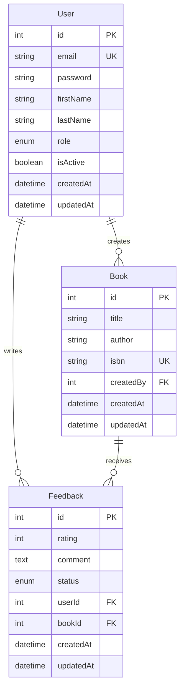

# 🏗️ Architecture Documentation

## Overview

The Book Management Portal backend is built using NestJS with a modular, domain-driven architecture. This document outlines the technical architecture, design patterns, and architectural decisions.

## 🏛️ Architecture Patterns

### Modular Architecture (Domain-Driven Design)

**Why**: Separates concerns by business domain (Auth, Books, Feedback)

**Implementation**: Each module contains entities, DTOs, services, controllers, and tests

**Benefits**: 
- Easier maintenance and testing
- Clear separation of responsibilities
- Scalable codebase structure
- Independent module development

### Repository Pattern

**Why**: Abstracts data access logic from business logic

**Implementation**: TypeORM repositories with custom query methods

**Benefits**:
- Database-agnostic business logic
- Easier unit testing with mock repositories
- Centralized data access patterns

### DTO Pattern (Data Transfer Objects)

**Why**: Validates and transforms data between layers

**Implementation**: Class-validator decorators with transformation

**Benefits**:
- Input validation at API boundaries
- Type safety across layers
- Clear API contracts
- Automatic serialization control

## 🗂️ Project Structure

```
src/
├── auth/                    # Authentication module
│   ├── decorators/         # Custom decorators (roles)
│   ├── dto/               # Data Transfer Objects
│   ├── entities/          # User entity
│   ├── guards/            # JWT and role guards
│   ├── strategies/        # Passport strategies
│   └── *.spec.ts          # Unit tests
├── books/                  # Book management module
│   ├── dto/               # Book DTOs
│   ├── entities/          # Book entity
│   └── *.spec.ts          # Unit tests
├── feedback/               # Feedback module
│   ├── dto/               # Feedback DTOs
│   ├── entities/          # Feedback entity
│   ├── feedback-throttler.guard.ts
│   └── *.spec.ts          # Unit tests
├── common/                 # Shared utilities
│   └── guards/            # Custom throttler guard
├── health/                 # Health check module
├── app.module.ts          # Root module
└── main.ts               # Application entry point
```

## 🗄️ Database Schema



## 🔐 Security Architecture

### JWT Authentication Strategy

**Why**: Stateless, scalable authentication

**Implementation**: Passport.js with JWT strategy

**Benefits**:
- No server-side session storage
- Cross-service authentication
- Self-contained token information
- Easy token validation

### Role-Based Access Control (RBAC)

**Why**: Granular permission management

**Implementation**: Custom decorators + guards

**Benefits**:
- Flexible permission system
- Easy role management
- Declarative security annotations
- Reusable authorization logic

### Password Hashing with Salt

**Why**: Protect against rainbow table attacks

**Implementation**: bcryptjs with 12 salt rounds

**Benefits**:
- One-way encryption
- Salt prevents precomputed attacks
- Configurable complexity
- Industry standard practice

## 🚀 Performance Architecture

### Rate Limiting Strategy

**Why**: Prevent API abuse and ensure fair usage

**Implementation**: Custom throttler guards with user-based tracking

**Benefits**:
- Per-user rate limiting
- Configurable limits per endpoint
- Memory-efficient tracking
- Graceful degradation

### Pagination Pattern

**Why**: Handle large datasets efficiently

**Implementation**: Offset-based pagination with metadata

**Benefits**:
- Reduced memory usage
- Better user experience
- Database query optimization
- Consistent API responses

### Query Optimization

**Why**: Minimize database load

**Implementation**: TypeORM query builders with selective loading

**Benefits**:
- Lazy loading of relations
- Optimized SQL queries
- Reduced data transfer
- Better caching strategies

## 🧪 Testing Architecture

### Test Pyramid Strategy

**Why**: Comprehensive coverage with optimal effort

**Implementation**: Unit tests (70%) + Integration tests (30%)

**Benefits**:
- Fast feedback loop
- Reliable test suite
- Cost-effective testing
- Clear test boundaries

### Test Isolation Pattern

**Why**: Prevent test interference

**Implementation**: Database cleanup between tests

**Benefits**:
- Deterministic test results
- Parallel test execution
- Reliable CI/CD pipeline
- Easy debugging

### Mock Strategy

**Why**: Isolate units under test

**Implementation**: Jest mocks for external dependencies

**Benefits**:
- Fast test execution
- Controlled test environment
- Focused unit testing
- Easy edge case testing

## 🔄 Data Management Architecture

### Entity Relationship Design

**Why**: Maintain data integrity and relationships

**Implementation**: TypeORM entities with proper foreign keys

**Benefits**:
- Referential integrity
- Cascade operations
- Clear data model
- Database-level constraints

### Circular Dependency Resolution

**Why**: Avoid circular imports in TypeScript

**Implementation**: String-based entity references + interfaces

**Benefits**:
- Clean module boundaries
- Type safety without circular imports
- Flexible entity relationships
- Maintainable code structure

### Database Seeding Strategy

**Why**: Consistent test data across environments

**Implementation**: Comprehensive seeding scripts with relationship mapping

**Benefits**:
- Realistic test scenarios
- Consistent development environment
- Easy data reset
- Comprehensive test coverage

## 🌐 API Design Architecture

### RESTful API Design

**Why**: Standard, intuitive API structure

**Implementation**: Resource-based URLs with HTTP methods

**Benefits**:
- Predictable API structure
- Easy client integration
- Standard HTTP semantics
- Cacheable responses

### Global Exception Handling

**Why**: Consistent error responses

**Implementation**: NestJS exception filters

**Benefits**:
- Unified error format
- Centralized error logging
- Better debugging experience
- Consistent API responses

### Validation Pipeline

**Why**: Ensure data integrity at API boundaries

**Implementation**: Class-validator with global validation pipe

**Benefits**:
- Automatic input validation
- Clear error messages
- Type safety
- Reduced boilerplate code

## 🔧 Configuration Architecture

### Environment-Based Configuration

**Why**: Different settings for different environments

**Implementation**: @nestjs/config with .env files

**Benefits**:
- Environment-specific settings
- Secure credential management
- Easy deployment configuration
- Centralized configuration

### Dependency Injection

**Why**: Loose coupling and testability

**Implementation**: NestJS built-in DI container

**Benefits**:
- Easy testing with mocks
- Loose coupling between modules
- Automatic dependency resolution
- Lifecycle management

## 📊 Monitoring & Logging Architecture

### Structured Logging

**Why**: Better debugging and monitoring

**Implementation**: NestJS built-in logger with context

**Benefits**:
- Consistent log format
- Easy log analysis
- Better debugging experience
- Production monitoring

### API Documentation

**Why**: Self-documenting API

**Implementation**: Swagger/OpenAPI with decorators

**Benefits**:
- Interactive API exploration
- Automatic documentation generation
- Client code generation
- API contract validation

## 🔄 Request Flow Architecture

### Authentication Flow

1. **Request arrives** with or without JWT token
2. **JWT Guard** validates token and extracts user info
3. **Role Guard** checks user permissions
4. **Controller** processes the request
5. **Service** handles business logic
6. **Repository** interacts with database
7. **Response** returned to client

### Error Handling Flow

1. **Exception thrown** at any layer
2. **Global Exception Filter** catches the exception
3. **Error transformation** to consistent format
4. **Logging** of error details
5. **Client response** with appropriate status code

### Validation Flow

1. **Request received** by controller
2. **DTO validation** using class-validator
3. **Transformation** of data types
4. **Business logic** processing
5. **Response serialization** using class-transformer

## 🚀 Scalability Considerations

### Horizontal Scaling

- **Stateless design** allows multiple instances
- **Database connection pooling** for efficient resource usage
- **Load balancer** distribution of requests
- **Caching strategies** for frequently accessed data

### Vertical Scaling

- **Memory optimization** with efficient data structures
- **CPU optimization** with async/await patterns
- **Database optimization** with proper indexing
- **Query optimization** with selective loading

### Performance Monitoring

- **Health checks** for service availability
- **Metrics collection** for performance analysis
- **Log aggregation** for debugging
- **Alert systems** for proactive monitoring
